# 🇪🇬 Egypt Gateway — Android

> A gamified travel companion for exploring Egypt's heritage, built as a graduation project.

Egypt Gateway is an Android application designed to make discovering Egypt's monuments more engaging, intelligent, and rewarding for tourists and locals alike. It combines interactive maps, AI-powered monument recognition, and a full gamification system to turn cultural tourism into an immersive experience, In addition, the application provides intelligent meal-time restaurant recommendations through scheduled notifications based on user food preferences and location.

---

## 📱 Screens & Features

### 🏛️ Home Screen
- Horizontal banner showcasing 10 major Egyptian monuments
- Location-aware nearby recommendations filtered by category: **Hotels**, **Restaurants**, **Cafes**, and **Malls**
- Recommendations update dynamically based on the user's current position and selected category

### 🗺️ Map Screen
- Full interactive map powered by **Google Maps SDK**
- Category filter bar at the top to switch between place types
- Displays the **10 nearest locations** sorted by real-world travel distance using the **Google Routes API**
- **Autocomplete search** (Google Places API) covering all places across Egypt
- Selecting a place from search renders a **polyline route** on the map with a destination marker

### 🤖 AI Monument Identifier
- Users can **capture a photo** or **upload from gallery**
- Photo is sent to the backend and processed by an AI model
- Classifies the monument among **10 Egyptian landmarks**
- Scanning a monument triggers the gamification system (mark as visited, earn points)

### 🎮 Gamification System
The entire gamification system is fully integrated between the mobile app and the backend server. All points, visit states, quiz results, and rewards are persisted and validated server-side — the mobile app reflects real-time state from the backend at all times.

- **Monument Visits** — Scan a monument to mark it as visited; the backend records the visit, awards points, and enforces the one-time-only rule per monument
- **Quizzes** — Monument-specific quizzes are fetched from the backend; answers are submitted and evaluated server-side for bonus points
- **Ratings** — Monument ratings are submitted to and stored on the backend, with points awarded upon successful submission
- **Tickets** — Ticket submissions are sent to the backend for review; points are awarded server-side once a ticket is approved

### 🎯 Objectives Screen
Objectives and their progress are fully managed and tracked on the backend. The mobile app fetches the current state of each objective and reflects live completion progress.

Two types of objectives:
- **Monument Objectives** — Each objective contains sub-tasks (visiting or scanning specific monuments); completion is tracked server-side and the objective reward is granted once all sub-tasks are fulfilled
- **Ticket Objectives** — Progress is tracked against defined approved-ticket milestones (1, 3, 5, 10 tickets); the backend evaluates eligibility and awards points upon reaching each milestone

### 🎫 Tickets Screen
Ticket submission and approval are fully handled through the backend. The mobile app communicates with the server to submit, track, and reflect ticket status in real time.

- Submit a ticket by uploading a photo; the request is sent to the backend for review
- The backend processes and approves or rejects the ticket
- Approved tickets automatically update the user's points and progress toward ticket objectives server-side, with the mobile app reflecting the updated state

- ### 🍽️ Meal Preferences Notifications
A personalized food recommendation feature integrated directly into the Profile screen through a simple dialog.

- Users can select their preferred **Lunch Time** and **Dinner Time**
- Users choose a preferred food category for each meal (e.g., Egyptian, Fast Food, Italian, Seafood, etc.)
- Notification scheduling is powered by:
  - Android AlarmManager
  - BroadcastReceiver
  - WorkManager
- At the selected meal time, the application automatically retrieves and recommends the **10 nearest restaurants** matching the chosen category based on the user's current location
- Recommendations are delivered through Android notifications, allowing users to quickly discover nearby dining options
- Preferences are configurable at any time through the Profile screen dialog


### 🏆 Leaderboard Screen
- Displays top users ranked by total points
- Shows the current user's live rank within the community

---

## 🛠️ Tech Stack

### Language & Architecture
| Layer | Technology |
|-------|-----------|
| Language | Kotlin |
| Architecture Pattern | MVI (Model-View-Intent) |
| Code Architecture | Clean Architecture (Presentation / Domain / Data) |
| Async & Reactive | Coroutines & Flow |
| Dependency Injection | Hilt |

### Authentication & Security
| Component | Technology |
|-----------|-----------|
| Authentication | Firebase Authentication |
| API Security | JWT — Firebase ID tokens are validated and exchanged with backend-issued JWTs to secure all API communication |

### Location & Maps
| Feature | Technology |
|---------|-----------|
| Interactive Map | Google Maps SDK for Android |
| Place Search & Details | Google Places API |
| Distance Sorting & Routing | Google Routes API |
| Nearby Restaurant Recommendations | Google Places API + Location Services |

### AI & Backend Integration
| Feature | Details |
|---------|---------|
| Image Upload | REST API (Multipart) |
| Monument Classification | Backend AI model — 10-class image classification |

### Notifications & Background Processing
| Feature | Technology |
|---------|-----------|
| Scheduled Meal Notifications | AlarmManager |
| Background Tasks | WorkManager |
| Notification Triggering | BroadcastReceiver |
| Push Notifications | Android Notification Manager |

---

## 🚀 Getting Started

### Prerequisites
- Android Studio Hedgehog or later
- Android SDK 26+
- A Google Cloud project with the following APIs enabled:
  - Maps SDK for Android
  - Places API
  - Routes API
- Firebase project with Authentication enabled

### Setup

1. **Clone the repository**
   ```bash
   git clone https://github.com/your-username/egypt-gateway-android.git
   cd egypt-gateway-android
   ```

2. **Add your `google-services.json`**
   - Download from your Firebase Console
   - Place it in the `app/` directory

3. **Add your API keys**
   - In your `local.properties` file, add:
   ```
   MAPS_API_KEY=your_google_maps_api_key
   ```
   - Or set them directly in `AndroidManifest.xml` under the appropriate `<meta-data>` tags

4. **Configure the backend base URL**
   - In your constants or `BuildConfig`, set:
   ```kotlin
   BASE_URL = "https://your-backend-url.com/"
   ```

5. **Build and run**
   - Open the project in Android Studio and run on a device or emulator

---

## 🔐 Authentication Flow

```
User Login (Firebase Auth)
        ↓
Firebase ID Token obtained
        ↓
Token sent to backend → Backend validates & issues JWT
        ↓
JWT stored securely on device
        ↓
All subsequent API requests use JWT in Authorization header
```

---

## 📸 Screenshots

### 🏠 Home & Detail
| Home | Detail |
|------|--------|
| 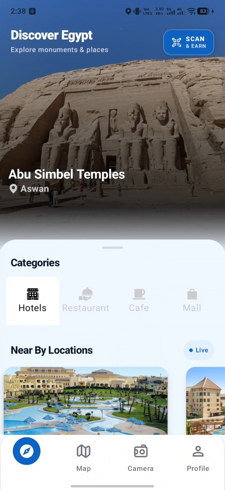 | 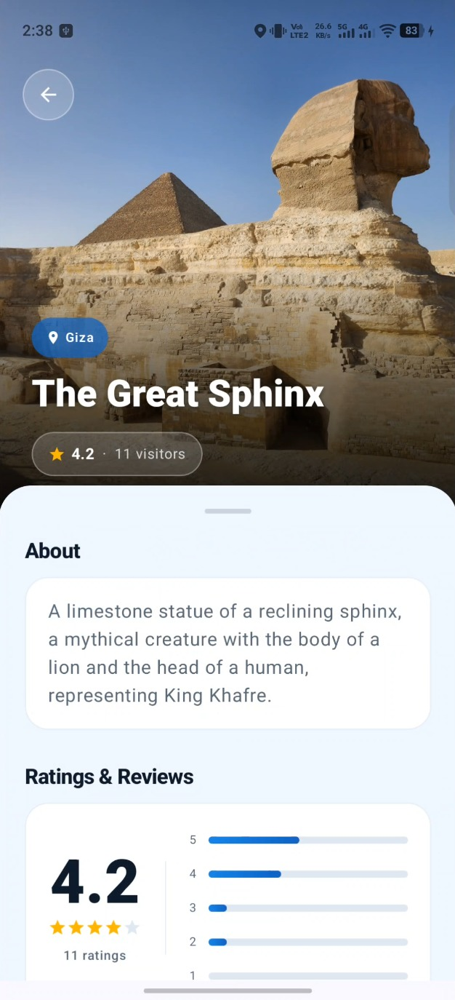 |

### 🗺️ Map
| Map View 1 | Map View 2 |
|------------|------------|
| 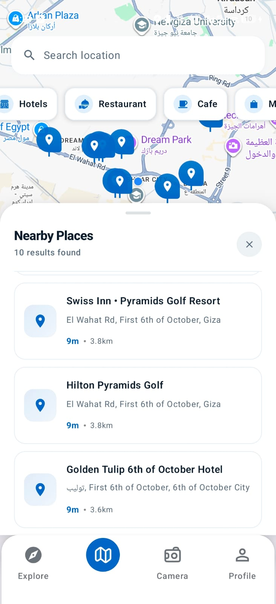 | 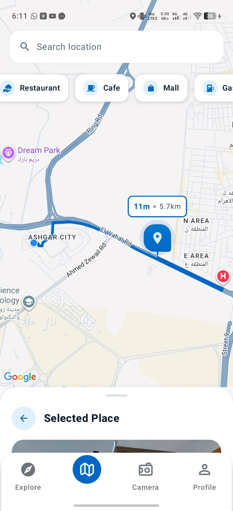 |

### 🤖 AI Monument Identifier
| Identifier 1 | Identifier 2 |
|--------------|--------------|
| 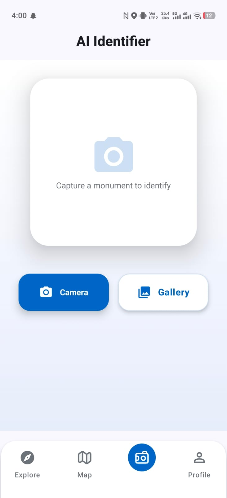 | 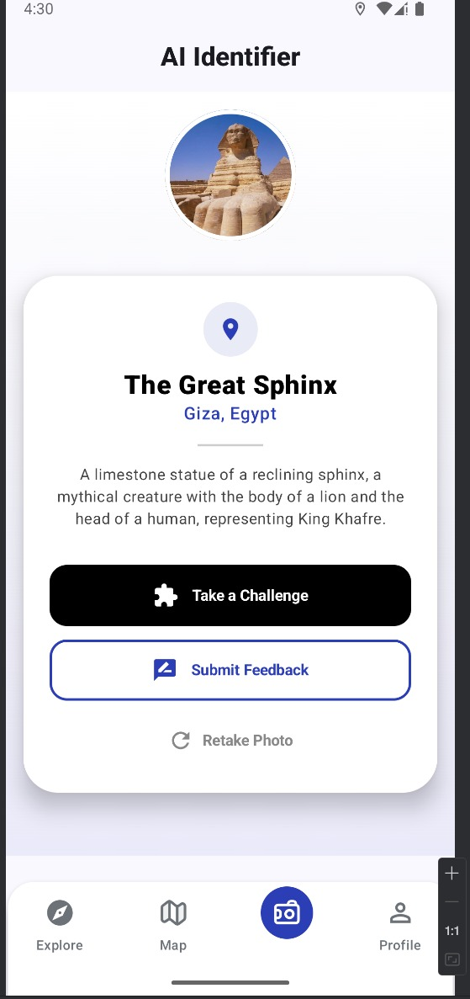 |

### 🎯 Objectives
| Objectives 1 | Objectives 2 |
|--------------|--------------|
| 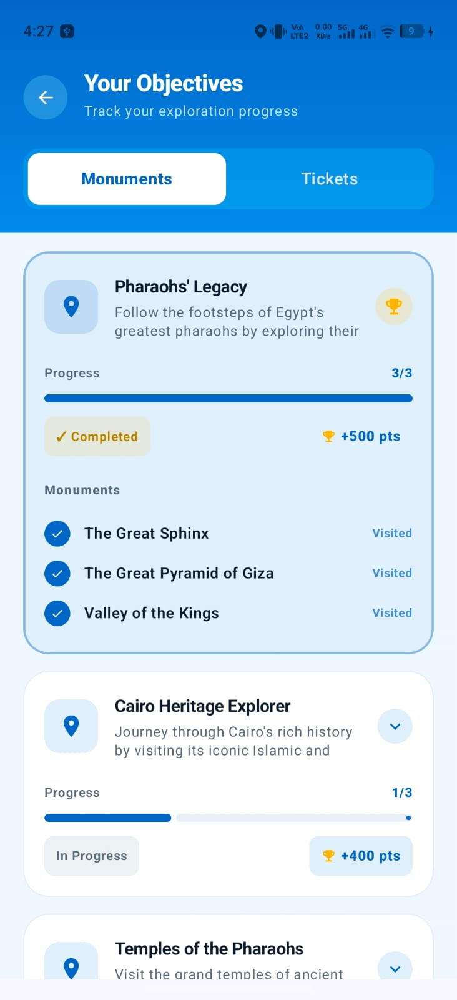 | 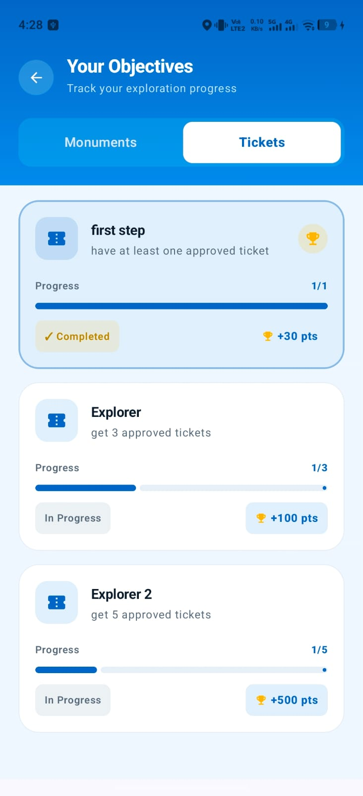 |

### 📝 Quiz
| Quiz 1 | Quiz 2 |
|--------|--------|
| 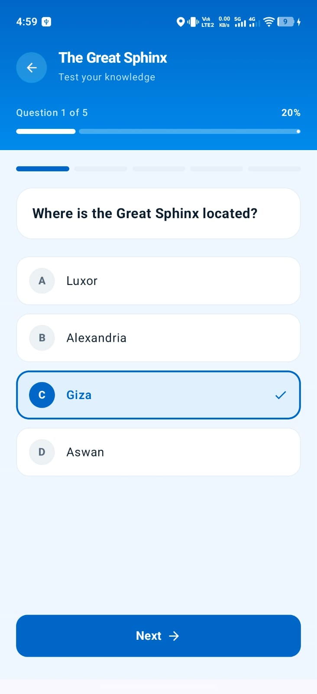 | 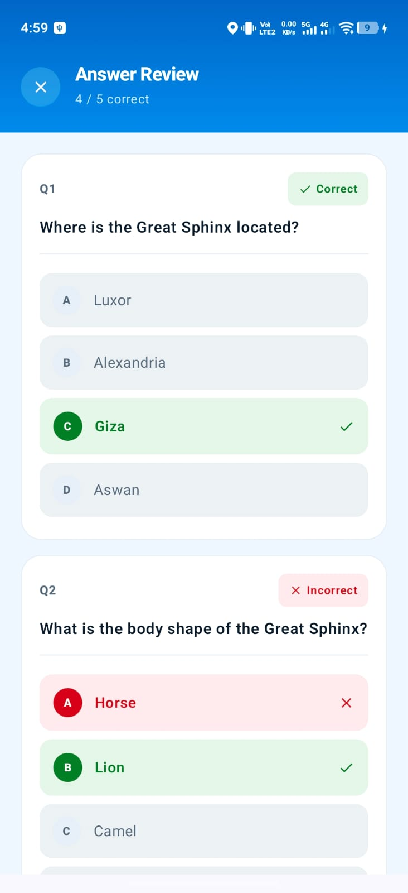 |

### 🎫 Tickets & Leaderboard
| Tickets | Leaderboard |
|---------|-------------|
| 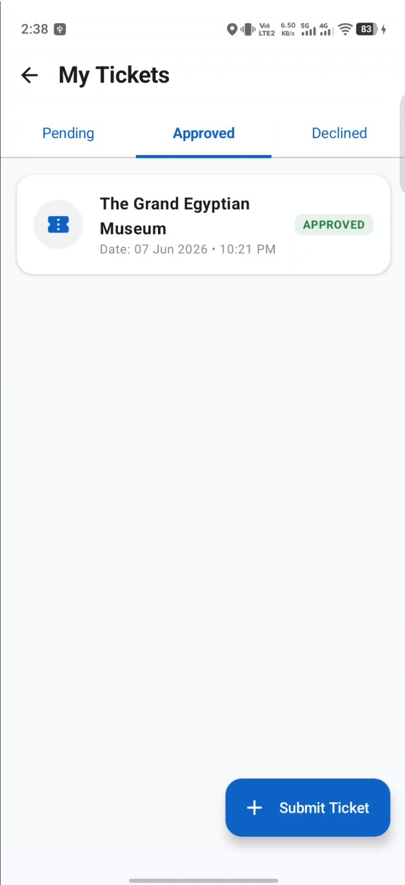 | 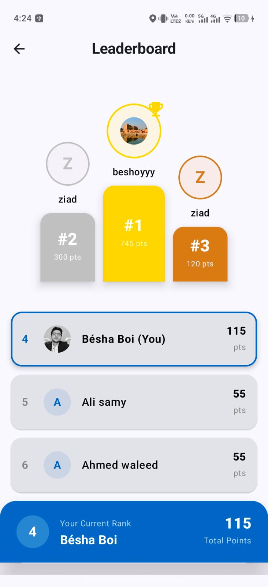 |

### 👤 Profile & Meal Preferences
| Profile | Meal Preferences |
|----------|------------------|
| 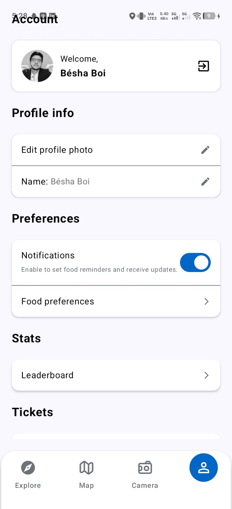 | 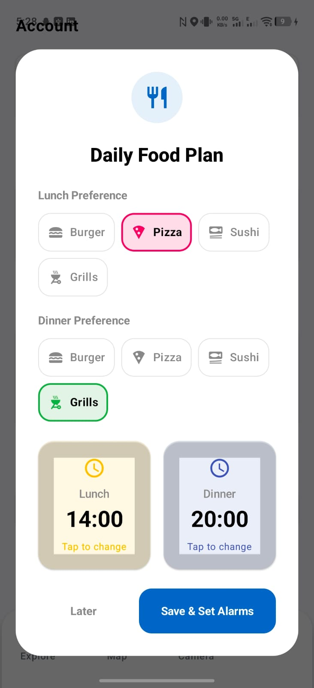 |

### 🔐 Login & Sign Up
| Login | Sign Up |
|-------|---------|
| 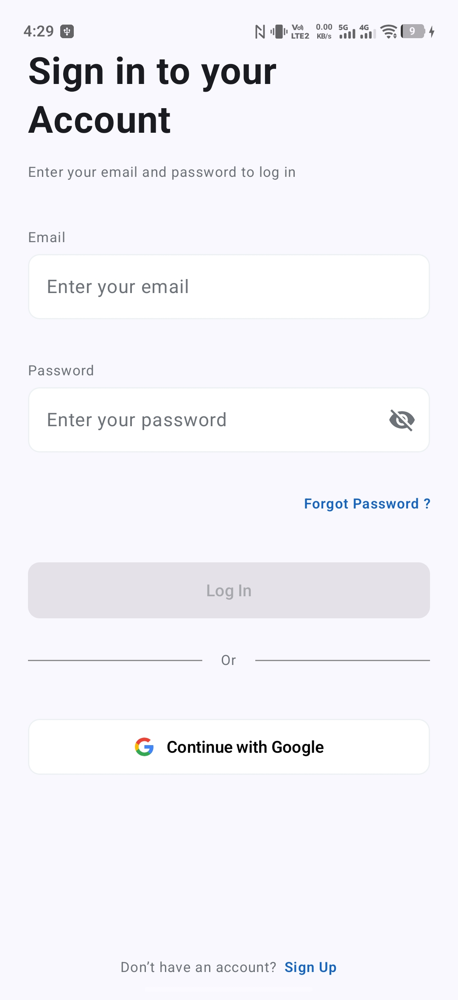 | 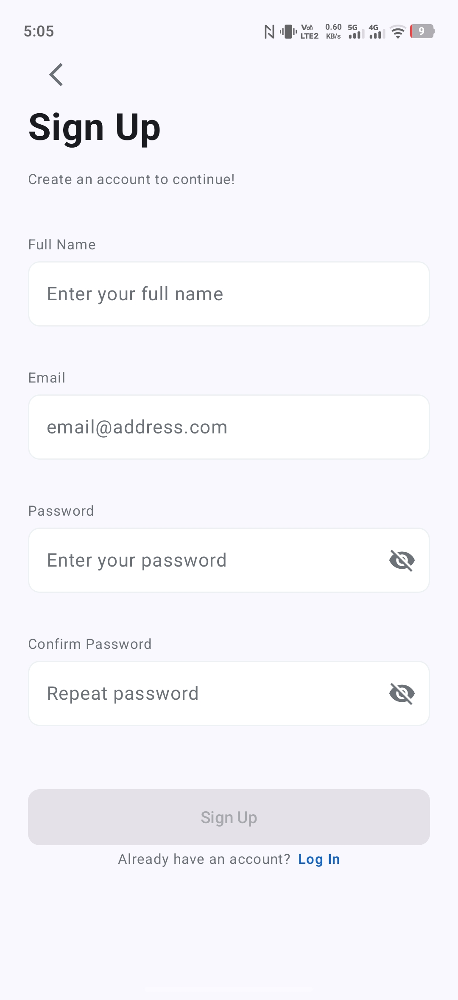 | 

---

## 🔗 Related Repositories

| Repository | Description |
|------------|-------------|
| [Egypt Gateway Backend](#) | REST API, AI model integration, JWT issuance |

---

## 👨‍💻 Author

**Beshoy Mamdouh**
- GitHub: [@ShinobiBoi](https://github.com/ShinobiBoi)
- LinkedIn: [Beshoy Mamdouh](https://www.linkedin.com/in/beshoy-mamdouh-128280293)

---

## 📄 License

This project is licensed under the MIT License. See the [LICENSE](LICENSE) file for details.
